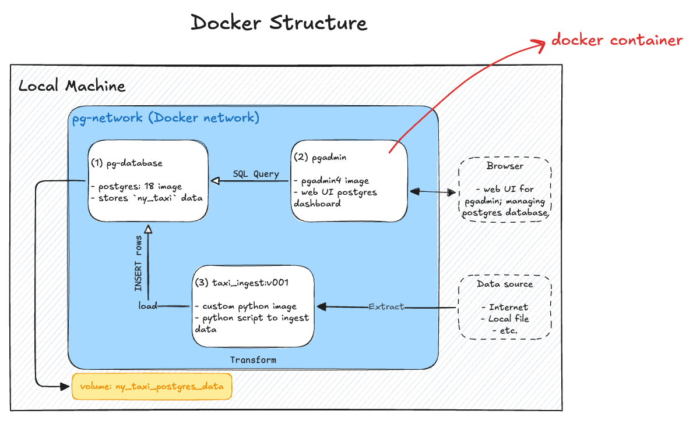

# Docker & Terraform

## Docker Structure


---

## What is Docker?

A platform to package applications into **containers** — isolated, reproducible environments
that run the same everywhere (your laptop, server, cloud).

**Why it matters for data engineering:**
- No "works on my machine" problems
- Easy to spin up databases, tools, and pipelines
- Reproducible environments for ETL jobs

---

## Key Docker Concepts

| Concept | What it is |
|---------|------------|
| **Image** | A blueprint/template (like a class) |
| **Container** | A running instance of an image (like an object) |
| **Dockerfile** | Instructions to build an image |
| **Volume** | Persistent storage that survives container restarts |
| **Port mapping** | `host:container` — exposes container ports to your machine |
| **Network** | Containers in the same `docker-compose` share a network automatically |

---

## Dockerfile Anatomy

```dockerfile
FROM python:3.13.11-slim              # Base image

COPY --from=ghcr.io/astral-sh/uv:latest /uv /bin/   # Multi-stage: copy uv binary

WORKDIR /app                          # Set working directory

ENV PATH="/app/.venv/bin:$PATH"       # Add venv to PATH

COPY pyproject.toml uv.lock ./        # Copy deps first (cache layer)
RUN uv sync --locked                  # Install dependencies

COPY ingest_data.py .                 # Copy application code

ENTRYPOINT ["python", "ingest_data.py"]  # Default command
```

**Layer caching tip:** Copy dependency files before source code.
If only your code changes, Docker reuses the cached dependency layer.

---

## Docker Compose

Defines and runs **multi-container** applications in a single YAML file.

```yaml
services:
  pgdatabase:                    # Service name = hostname on the network
    image: postgres:18
    environment:
      - POSTGRES_USER=root
      - POSTGRES_PASSWORD=root
      - POSTGRES_DB=ny_taxi
    volumes:
      - "ny_taxi_postgres_data:/var/lib/postgresql:rw"
    ports:
      - "5432:5432"              # host:container

  pgadmin:
    image: dpage/pgadmin4
    environment:
      - PGADMIN_DEFAULT_EMAIL=admin@admin.com
      - PGADMIN_DEFAULT_PASSWORD=root
    ports:
      - "8085:80"

volumes:
  ny_taxi_postgres_data:         # Named volume for data persistence
```

**Key commands:**

```bash
docker compose up          # Start all services
docker compose up -d       # Start in background (detached)
docker compose down        # Stop and remove containers
docker compose ps          # List running containers
docker compose logs -f     # Follow logs
```

**Networking:** Containers reference each other by **service name** (e.g., `pgdatabase` as hostname), not `localhost`.

---

## Data Ingestion Pipeline

The pipeline downloads NYC taxi CSV data and loads it into Postgres in chunks.

```
CSV (from GitHub) → pandas (chunked read) → PostgreSQL
```

**Key pattern: chunked ingestion**

```python
df_iter = pd.read_csv(url, iterator=True, chunksize=100000)

for df_chunk in df_iter:
    df_chunk.to_sql(name=table, con=engine, if_exists='append')
```

Why chunks? The full CSV is too large to fit in memory at once.

**Running the ingestion container:**

```bash
docker build -t taxi_ingest .

docker run --network=pipeline_default taxi_ingest \
  --pg-host pgdatabase \
  --pg-user root \
  --pg-pass root \
  --pg-db ny_taxi \
  --year 2021 \
  --month 1
```

> Note: `--network` must match the docker-compose network so the container can reach `pgdatabase`.

---

## Terraform

Infrastructure as Code (IaC) — define cloud resources in `.tf` files instead of clicking through the console.

### Why Terraform?

- **Reproducible** — same config = same infrastructure every time
- **Version controlled** — track infrastructure changes in git
- **Multi-cloud** — works with GCP, AWS, Azure, etc.

### File Structure

| File | Purpose |
|------|---------|
| `main.tf` | Resource definitions (what to create) |
| `variables.tf` | Input variables (configurable values) |
| `terraform.tfstate` | Current state of infrastructure (auto-generated, don't edit) |

### main.tf Breakdown

```hcl
terraform {
  required_providers {
    google = {
      source  = "hashicorp/google"
      version = "6.8.0"
    }
  }
}

provider "google" {
  credentials = file(var.credentials)    # Service account key
  project     = var.project
  region      = var.region
}

# GCS Bucket
resource "google_storage_bucket" "demo-bucket" {
  name          = var.gcs_bucket_name
  location      = var.location
  force_destroy = true
  storage_class = var.gcs_storage_class
}

# BigQuery Dataset
resource "google_bigquery_dataset" "demo_dataset" {
  dataset_id = var.bq_dataset_name
  location   = var.location
}
```

### Key Commands

```bash
terraform init      # Download provider plugins
terraform plan      # Preview what will be created/changed
terraform apply     # Create/update resources
terraform destroy   # Delete all resources
```

### Workflow

```
terraform init  →  terraform plan  →  terraform apply
   (once)          (review changes)    (create resources)
```

> ⚠️ Always run `terraform plan` before `apply` to review changes.
> ⚠️ Don't forget `terraform destroy` when done to avoid GCP charges.

---

## GCP Resources Created

| Resource | Terraform Resource Type | Purpose |
|----------|------------------------|---------|
| GCS Bucket | `google_storage_bucket` | Store raw data files |
| BigQuery Dataset | `google_bigquery_dataset` | Data warehouse for querying |

---

## Reference

https://github.com/DataTalksClub/data-engineering-zoomcamp/tree/main/01-docker-terraform
